## Dataset
We are using the [The Laval HDR databases](http://indoor.hdrdb.com/). It contains 2100+ high resolution indoor panoramas. Here are some examples: (Tone-mapped back gamma color space, 8 bit color)

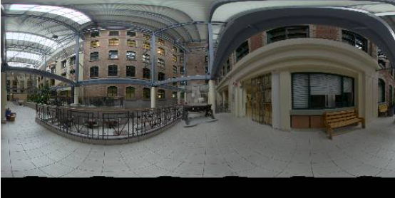
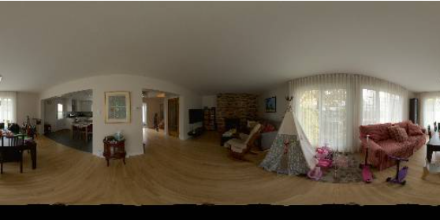

## Labeling process
The main goal of the preprocess stage is to develop a realist representation of lights in our environment map. It is not possible to use the map as a light source in real time render engines. Therefore, We are using the light types accepted by most of the render engines, for example, directional light, point light, or area light. We first developed a naive translation based on the paper. Then we improve the labeling process by only use directional and point light.

**We will illustrate the labeling process by this example**

Original Image
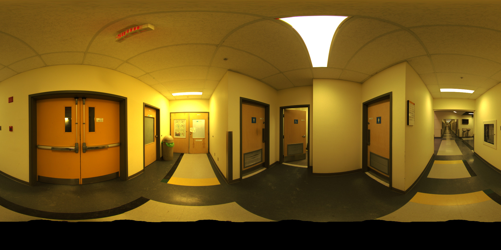
### Naive approach
We use JPG/(uint8) as the data format
- The brightest parts in the environment map are usually the most significant light sources when rendering virtual objects. Since our data set is using linear and HDR colors, it is easy to find the them by setting a threshold. The extreme is defined as the maximum pixel value after summing up the values along the channel axis. We extract the maximum value in the environment map and set the threshold at 10%. Any parts above that is considered as "bright enough". Here are the significant parts in this map
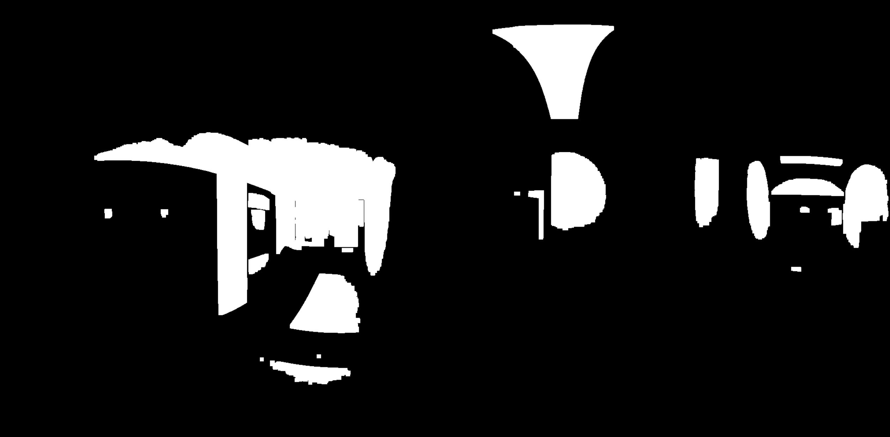
- Then we find the connected component in this map. We use `measure.label()` in OpenCV and sort them based on their size and brightness. If a component is smaller than 300 pixels, it will be discarded. Here are some parts we extracted.
--|--
 | 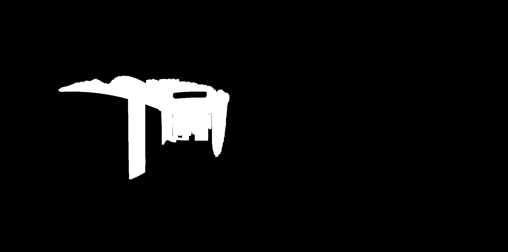
- In the final step, our algorithm would draw a minimum area rectangle that surrounds each light source. The parameters defining the minimum area rectangle would also define the parameters for an ellipse. We would use the parameters as the label for each light source. 
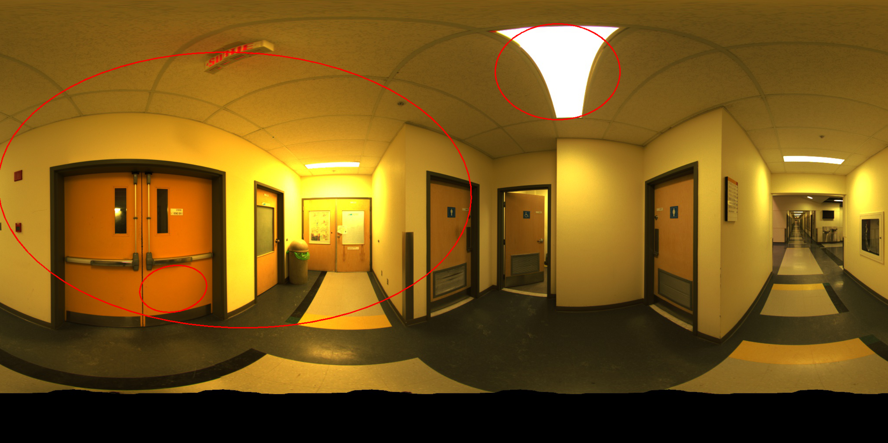
- Evaluation: 
    We rendered a chair using this environment map as a background in Blender. This is generated using path trace algorithm and takes 20 seconds to calculate. We considered it as the ground truth. 

    Ground Truth | Naive Approach
    ------------ | ------------- 
    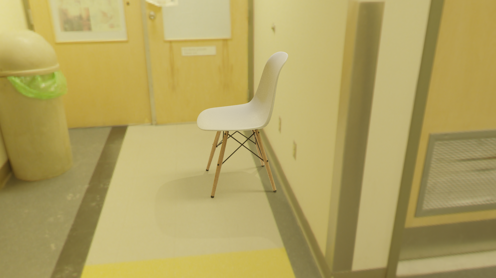| 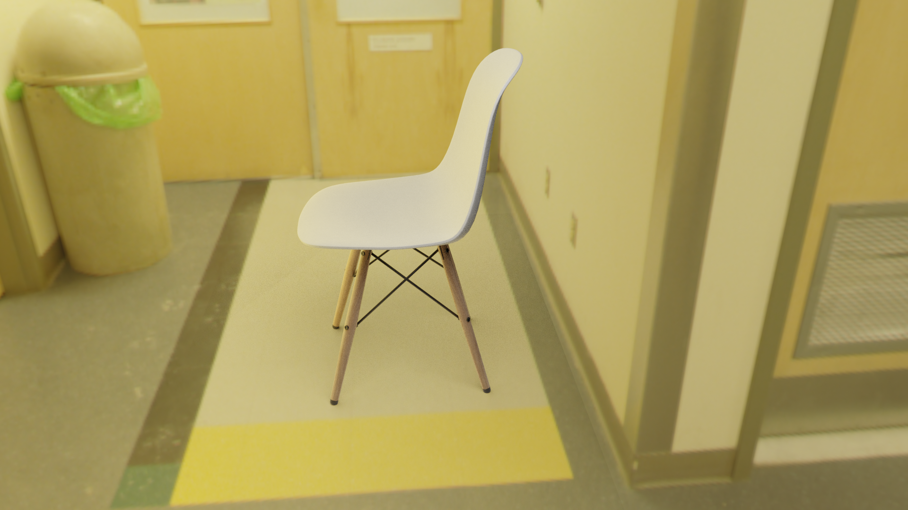
    we think this result have several artifacts 
    1. One of the huge contributor to realism is shadows. We can observer the shadows of the chair in the ground truth, but there is only a little shadow very close to the leg. As comparison, the shadow of the rubbish bin contribute a lot to the realism of that object
    2. Too much information is lost when using the Uint8 representation. Many bright light saturated at its maximum value, so we cannot make the comparison of which light is brighter. Moreover, the color of the lights are lost during the conversion. For example, we can see the orange light at the leg. This is coming from the orange door on the left, and this indirect light should not be as bright as the light coming from top.
    3. This cannot be done in real time. The result is rendered using the same technic as the ground truth, with the labeler output as the light source. So we cannot use it in real time AR applications. 
    4. The bright part of this render is too bright and dark part is too dark. The surface of the chair loses all information about its geometry. On the contrary, the junction between the surface and the legs are too dark. 
    5. Subjectively, we don't think this is great. We sent this image to some of our friends and ask them to rate the realism. Most of them rated as "it looks fake, but acceptable". On the other hand, all of them rate the ground truth is better than the rendered result using naive approach. 
### Advanced approach
With all the artifacts and bads our naive approach has, we were looking for a new labeler and probably new types of lights. we took a closer look to our datasets and found two kwy observations 
1. The number of visible shadows of an object is normally not more than 5. Since more distant lights are less significant and will cause shallow shadows. Also they are closer together in the object's perspective. Our brain will try to merge these shadows rather than distinguish them. Therefore using a few directional lights can capture strongest and closest lights.
2. The darker side of any objects is not completely dark. Various indirect lights (such as reflections from the wall) will light them up. These lights are typically large and at the opposite direction of the strong lights. Using point lights can capture these effects well.
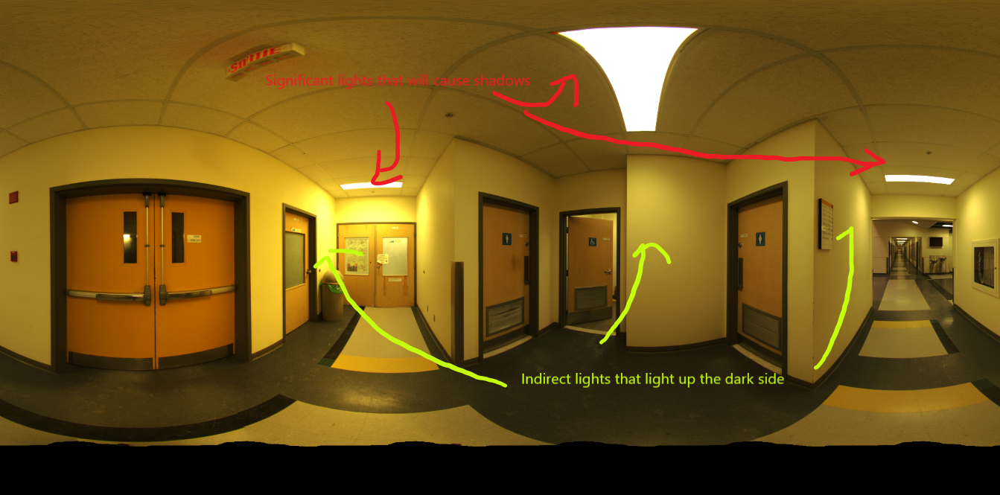 
With those in mind, we created a new labeler. This labeler will use Exr files(float32) to capture the HDR information in the environment map. It will find 3 directional lights and 3 point light with different criteria. 
#### Steps
- Create the significance map with to brightness thresholds. One with high threshold aimed to capture directional lights. One with lower threshold aimed at capturing indirect lights. The pixels in high threshold map will be removed from the low threshold map. 

High Threshold | Low Threshold |Low Threshold map - High Threshold map
------------ | -------------| -------------
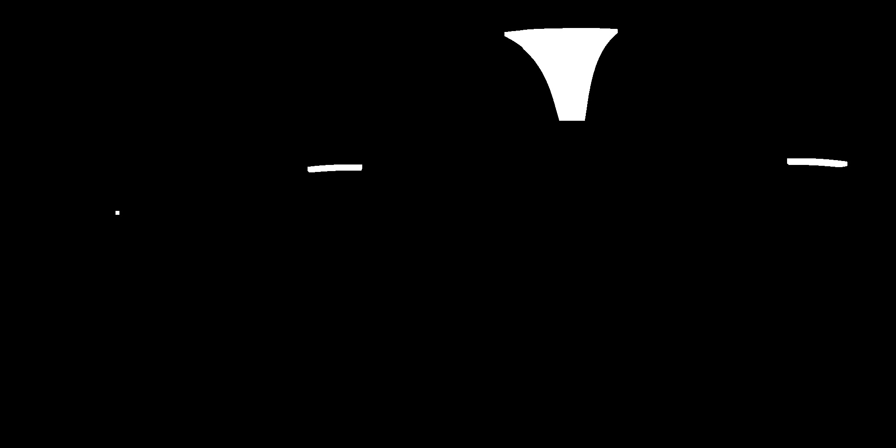|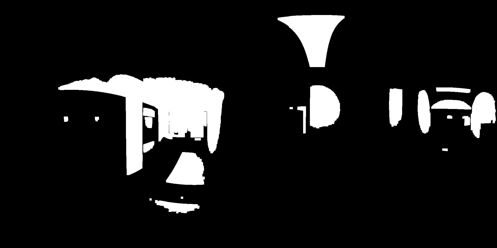 |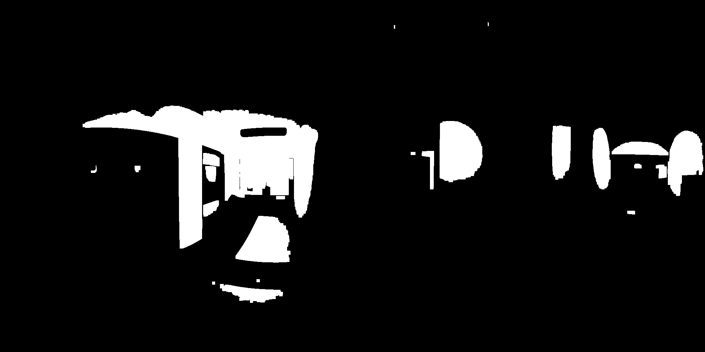 

- Similar way of finding connected component is used. However, there is no size requirement for directional lights. A header LED light might appears to be very small in the environment map. 
- Adjust the threshold to find exactly 3 significant light and 3 indirect lights

High Threshold Last iteration| Low Threshold Last iteration|Low Threshold map, removing not significant part 
------------ | -------------| -------------
|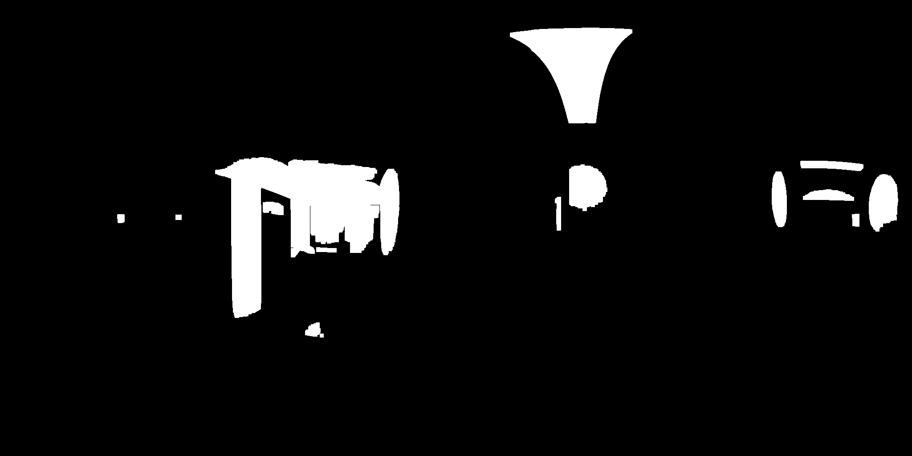 |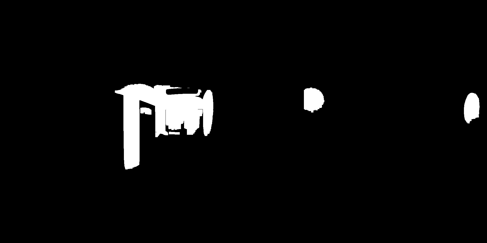 
- Averages of these pixels are calculated in spherical coordinates. 
#### Results

Ground Truth | Naive Approach | Advanced Approach
------------ | ------------- | ------------- 
| | 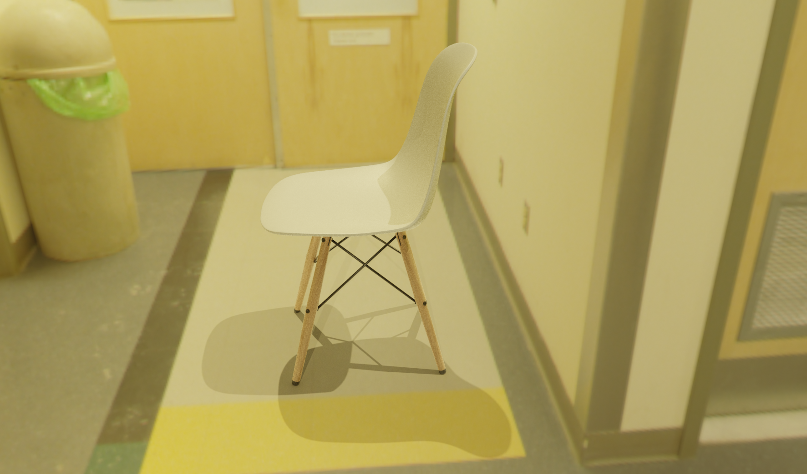
We believed that this is an acceptable approximation of the lighting condition in the environment. The color of the chair is very similar to the ground truth. The self-shadow on the back of the chair is preserved, unlike all white in our naive approach. No parts on the chair is too dark or too bright. 

The positions of the shadows in our labeled result align with the shadows in ground truth. However, due to the limitation of render engine, we cannot produce realistic soft shadows in real time. The hard shadows is a compromise we made to reach real-time relighting. Though our approach is not as convincing as the ground truth, it increase the realism 

## Data Generation

### Cropping
Our goal is predicting the scene's illumination from a single image, so we need to generate normal image from the environment map. We used a very simple algorithm to take a picture in the environment map. 
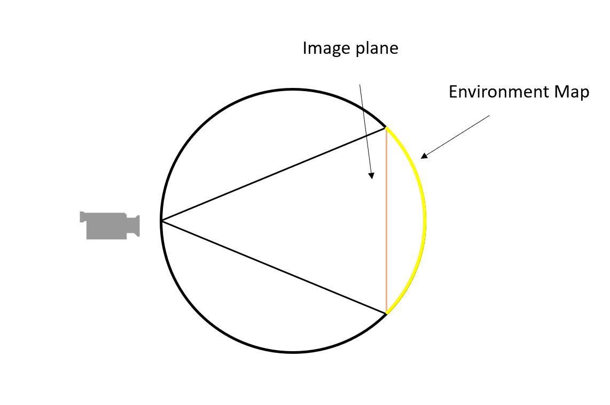
Here are some examples from our cropper (Color adjusted for display)
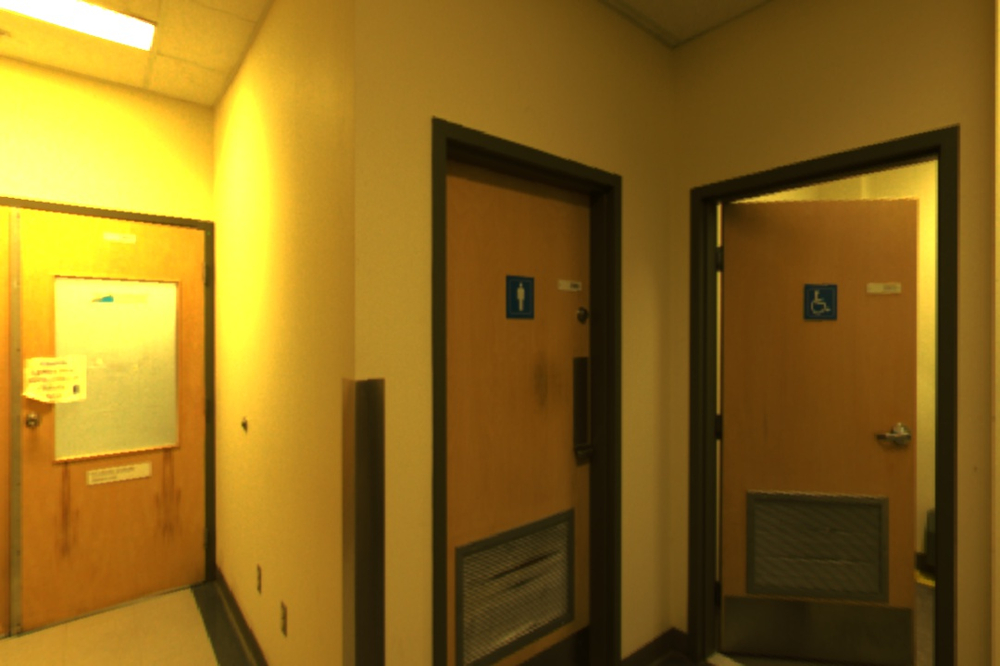 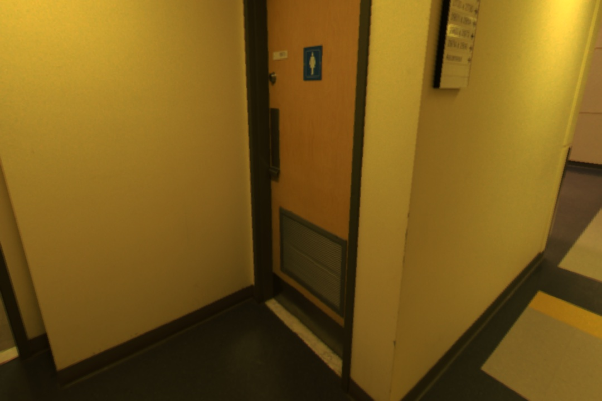
### Labels rotation
To prevent the orientation of the camera affecting the result, we translate all labels into the camera's coordinate. 

### Examples
Here are some rendering examples from the data we used for training

Rendering setup.
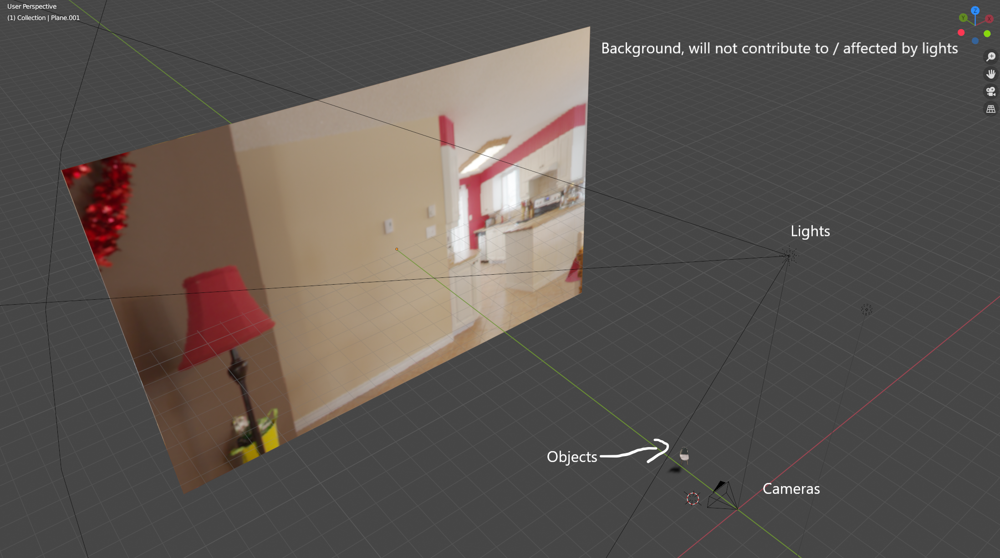

Examples - Classroom | Examples - Home
------------ | -------------
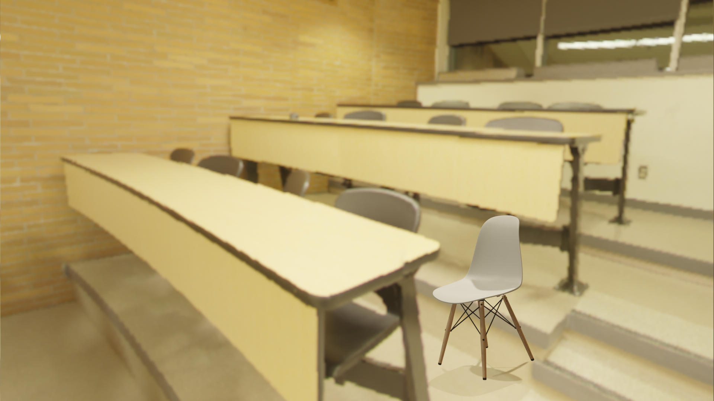|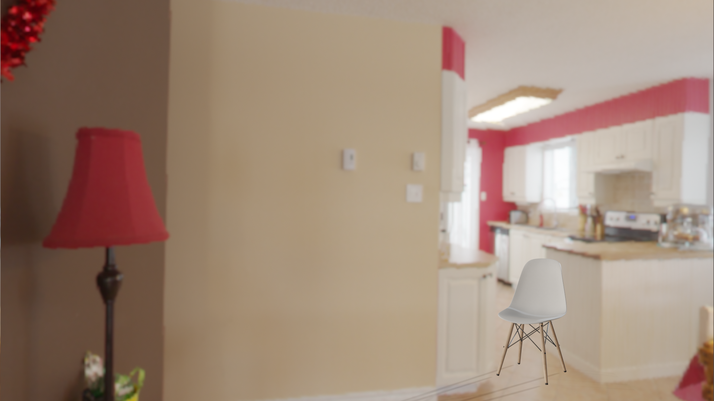
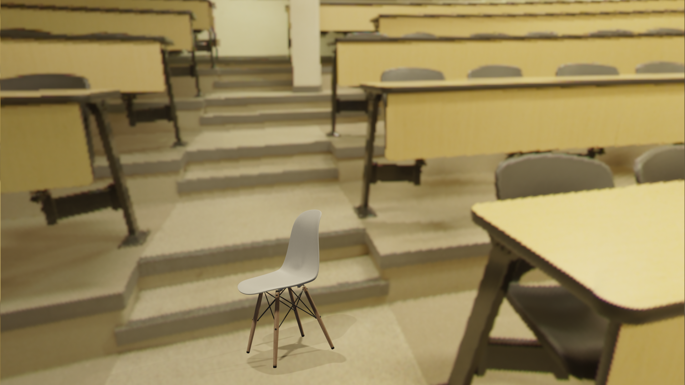 | 

## Post-Processing
In our assumption, we stated that we assume the lighting condition of the camera should be very similar or exactly the same as our virtual object. However, this assumption is highly possible to be violated. We have to insert the object in front of the camera and the environment maps are taken in a relatively small room. Therefore even a small change in distance would possibly cause noticeable change in lighting conditions. On the other hand, 99% of the lights in our dataset and in real life is at the celling.  We created an simple rotation mechanism to alleviate this issue: it will rotate all the lights upwards to approximate the distance between camera and the object.
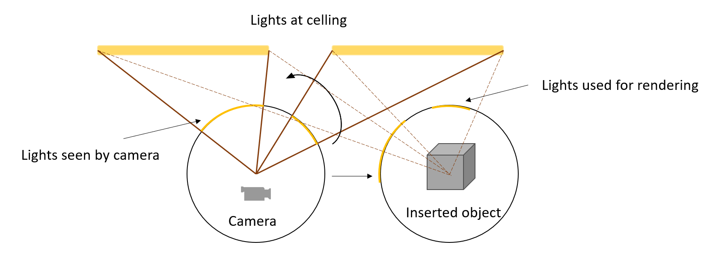
From this example, The lighting angle at camera's position is very different to the object's position and our assumption does not hold. With the rotation, the rendered result would be much more accurate. 
